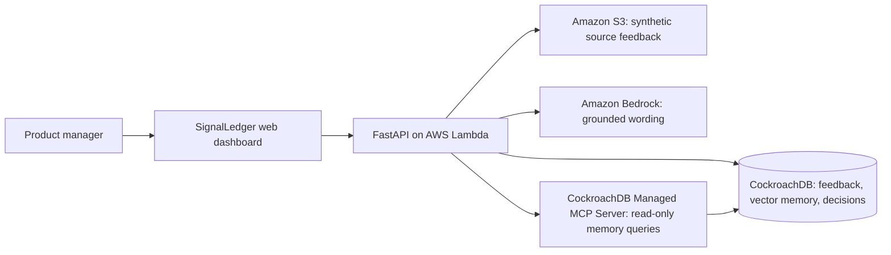

# SignalLedger architecture

The application writes feedback, task state, decisions, and evidence links into CockroachDB. Semantic retrieval uses the `feedback_items.embedding` vector index. The agent uses the Managed MCP Server as a read-only, auditable memory boundary; its application identity retains separate least-privilege write access for explicit feedback and decision records.

Amazon S3 stores the synthetic seed set and Lambda hosts the API. Bedrock may rewrite only the recommendation wording after evidence is selected; it is not allowed to add evidence or change the deterministic decision state.
