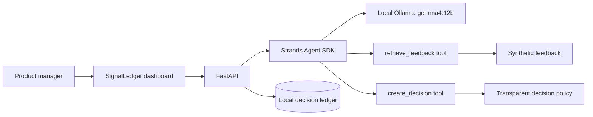

# SignalLedger architecture

The Strands agent has exactly two custom tools. `retrieve_feedback` returns at most four synthetic feedback records relevant to the question. `create_decision` applies the deterministic policy, cites those records, and creates either a build recommendation or a measurable validation experiment.

The model is local Ollama at `http://127.0.0.1:11434`; no AWS account, cloud credentials, API key, customer connector, shell tool, or browsing tool is used. FastAPI retains the decision history and rejects feedback that is not explicitly marked synthetic.
